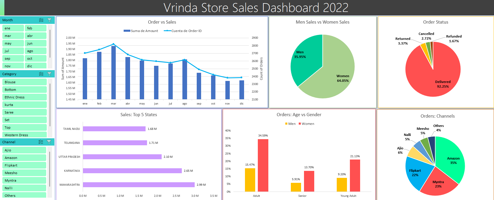

# Vrinda Store Sales Dashboard 2022

Welcome to the Vrinda Store Data Analysis Project! This project focuses on creating the 2022 Vrinda Store Sales Dashboard using Microsoft Excel.

## Project Objective

Vrinda store wants to create an annual sales dashboard for 2022. So
that, Vrinda can understand their customers and grow sales in 2023.

## Project Overview

### Data

You can see the dataset here [Vrinda Store Dataset](./dataset.csv)

### SQL Analysis

Explore the following resources:

- [SQL Analysis Script:](./analysis.sql) The SQL script used for data analysis.
- [Query Results:](./analysis.docx) A document containing the results of the executed queries.
- [Database Backup (.bacpac):](./vrindaStore.bacpac) A backup file of the database, including its schema and data.

### Project

You can see the final project here [Project](./dashboard.xlsx)

### Conclusions

- March is the month with the highest sales and orders (Amount: 1.95M - Orders: 2.8K)
- Women are more likely to buy compared to men (65%)
- The most common order state is delivered (93%)
- Maharashtra, Karnataka and Uttar Pradesh are the top 3 sates in sales (70%)
- Adult age group (30 - 49 years) is max contributing (50%)
- Amazon, Flipkart and Myntra channels are max contriguting (80%)
